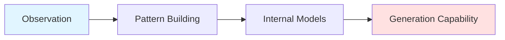

# The Observation Paradox

> What Quantum Mechanics Teaches Us About Solving Hard Problems

A technical exploration of the P=NP problem through the lens of quantum observation, computational complexity, and practical DevOps work.

---

## Table of Contents

- [Overview](#overview)
- [The P=NP Problem](#the-pnp-problem)
- [The Verification-Generation Gap](#the-verification-generation-gap)
- [Quantum Computing and BQP](#quantum-computing-and-bqp)
- [Practical Applications](#practical-applications)
- [Agentic AI and Complexity](#agentic-ai-and-complexity)
- [Implications](#implications)
- [Further Reading](#further-reading)
- [Contributing](#contributing)

---

## Overview

In quantum mechanics, observation collapses superposition. The moment you measure a quantum state, uncertainty vanishes and the state becomes known. **Observation is resolution.**

In classical computing and knowledge work, observation and solution are fundamentally different operations. This gap is formalized in the **P=NP problem**: does being able to quickly verify a solution mean we can also quickly find it?

This repository explores this question through three lenses:
1. **Computational complexity theory** (P, NP, BQP)
2. **Quantum computing's approach to observation**
3. **Practical engineering work** (DevOps, code review, system design)

---

## The P=NP Problem

### Definitions

| Class | Definition | Example |
|-------|------------|---------|
| **P** | Problems solvable in polynomial time | Sorting algorithms, graph searches |
| **NP** | Problems verifiable in polynomial time | Traveling salesman, protein folding, encryption breaking |
| **BQP** | Quantum polynomial time | Factoring (Shor's algorithm), database search (Grover's algorithm) |

### The Core Question

```
Can recognizing correctness give us the power to create it?

IF (can_verify_quickly(solution)) 
THEN (can_find_quickly(solution)) ?
```

Most complexity theorists believe: **P ⊂ BQP ⊂ NP**

Quantum computing sits *between* classical computation and nondeterministic power, but doesn't collapse the gap entirely.

---

## The Verification-Generation Gap

### In Code Review

```yaml
Observation: "This Terraform module is elegant"
├── Fast recognition of quality
├── Pattern matching (edge cases, state management, scalability)
└── But: Could I have written it from scratch?
    ├── Sometimes: Yes (pattern within expertise)
    └── Sometimes: No (requires creative leap)
```

### The Asymmetry

Many critical problems are in NP:
- ✅ **Easy to verify**: Check if protein structure is stable
- ✅ **Easy to verify**: Calculate delivery route efficiency  
- ✅ **Easy to verify**: Confirm solution correctness
- ❌ **Hard to generate**: Find optimal protein folding
- ❌ **Hard to generate**: Compute best route
- ❌ **Hard to generate**: Create solution from scratch

---

## Quantum Computing and BQP

### How Quantum Systems Differ

**Classical Computing:**
```
Explore path_1
IF fail: Explore path_2
IF fail: Explore path_3
...
```

**Quantum Computing:**
```
Superposition: Exist in [path_1, path_2, path_3, ...] simultaneously
Interference: Amplify correct paths, cancel incorrect ones
Measurement: Collapse to solution
```

### What Quantum Computing Achieves

- Creates new complexity class: **BQP**
- Breaks specific problems (e.g., factoring via Shor's algorithm)
- Reveals: There are more ways to "observe" solution spaces than classical computation allows
- **Does NOT** collapse P into NP
- Observation becomes *part of* the computational process

### Key Insight

> Quantum systems leverage measurement and interference to expand what's computationally tractable. But the fundamental gap between verification and generation persists.

---

## Practical Applications

### DevOps Debugging Example

**Scenario:** Mysterious latency spikes in GCP infrastructure

**Level 1: Verification** ⚡ Fast
```bash
# Is it the Cloud SQL connection pool?
gcloud sql operations list --instance=prod-db
# Check metrics → Yes/No answer
```

**Level 2: Pattern Recognition** ⚡ Fast
```
Signature observed → Previously seen → N+1 query problem
Pattern matching → Almost instantaneous
```

**Level 3: Solution Generation** 🐢 Requires Deep Understanding
```python
# Restructure API call batching
# Implement caching layer
# Requires: System understanding + Creative synthesis
```

### The Learning Progression



Each observation collapses possibility space → Constrains future problem-solving → Builds generative capacity over time

---

## Agentic AI and Complexity

### Current AI Capabilities

| Capability | Performance | Complexity Class |
|------------|-------------|------------------|
| Pattern recognition | Excellent | NP (verification) |
| Code review | Strong | NP (verification) |
| Bug detection | Strong | NP (verification) |
| Novel architecture | Limited | Requires P-level generation |
| Unprecedented problems | Limited | Creative solution space |

### The Fundamental Limit

```
IF P ≠ NP (likely true)
THEN no AI system can efficiently solve ALL hard problems

BUT: AI shifts which problems require human creativity
     (Similar to how QC moved some problems to "quantum tractable")
```

### What AI Does

- ✅ Explores space between verification and creation
- ✅ Automates pattern-based solutions
- ✅ Accelerates observation → learning loop
- ❌ Does NOT collapse verification into generation
- ❌ Cannot bypass fundamental complexity barriers

---

## Implications

### For Engineering Organizations

**Observation is Powerful**
- Code review teaches patterns
- System observation builds intuition
- Verification enables learning

**But Observation ≠ Creation**
- Need both observers (reviewers, mentors, architects)
- Need creators (implementers, designers, builders)
- Gap between recognition and generation is real

### The Bridge

```
Observation → Understanding → Generation

Where "Understanding" = Deep comprehension enabling novel solutions
Not just pattern matching or verification
```

### The Human Element

The leap from NP (verification) to P (generation) requires:
- Systems thinking
- Creative synthesis  
- Intuition development
- Problem decomposition
- Novel approach generation

**This gap may be mathematically unclosable. Bridging it remains our most interesting challenge.**

---

## Further Reading

### Complexity Theory
- [P vs NP Problem](https://en.wikipedia.org/wiki/P_versus_NP_problem) - Clay Mathematics Institute
- [Computational Complexity: A Modern Approach](https://theory.cs.princeton.edu/complexity/) - Arora & Barak

### Quantum Computing
- [Quantum Complexity Theory](https://arxiv.org/abs/0804.3401)
- [BQP and the Polynomial Hierarchy](https://arxiv.org/abs/0910.4698)

### Practical Applications
- HashiCorp Vault Architecture Patterns
- Infrastructure as Code Best Practices
- CI/CD Pipeline Optimization Techniques

---

## Contributing

This is a living document exploring the intersection of complexity theory, quantum computing, and practical engineering work.

**Discussion Topics:**
- Where do you see the verification-generation gap in your work?
- How do you bridge observation and creation?
- What role does AI play in your problem-solving process?

**Author:** Sam Burwood- DevOps Engineer @ HSBC  
**Specializations:** HashiCorp Vault, GCP Infrastructure, Terraform IaC, CI/CD Pipelines

---

## License

This work is shared under [CC BY 4.0](https://creativecommons.org/licenses/by/4.0/) - feel free to adapt and share with attribution.

---

*"The gap between verification and creation persists. Maybe that's okay. Maybe it's even essential."*
